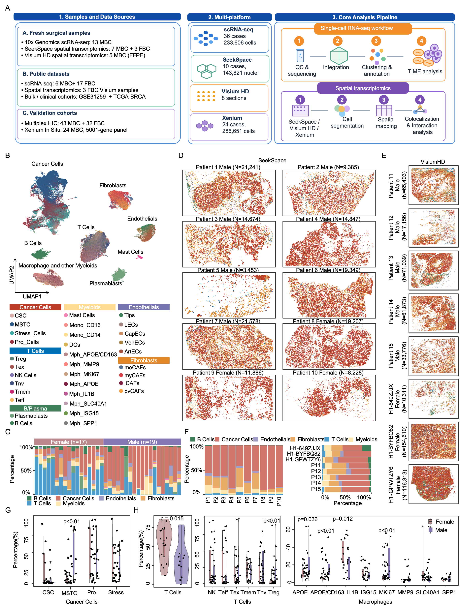

**Multi-platform Single-Cell & Spatial Transcriptomics Reveal Sex-Specific Malignant States and Architecture in Male Breast Cancer**

Male breast cancer (MBC) is rare and remains largely managed using knowledge derived from female breast cancer. Here, we generated a multi-platform single-cell and spatial transcriptomic atlas integrating scRNA-seq, SeekSpace, Visium HD, Xenium In Situ and mIHC data from male and female breast cancer cohorts, covering more than 660,000 cells. We identified male-specific tumor cells (MSTCs) that were enriched in MBC, rare in female breast cancer and associated with poorer disease-free survival. MSTCs exhibited neural transcriptional programs, increased transcriptome-inferred CNV burden and spatial coupling with fatty-acid-metabolism signals. MSTC-enriched regions showed reduced antigen-presentation signatures and spatial association with APOE+/CD163+ macrophages, with GRN–SORT1 emerging as a candidate macrophage–tumor interaction axis. These findings define an MBC-associated malignant state and its immune-metabolic spatial context.

## Pre-requisites:

- Linux (Based on Ubuntu 20.04 LTS, Personal Computer) 
- CPU AMD Ryzen threadripper pro 3975wx 32-cores x 64
- NVIDIA GeForce RTX 3090 24GB 384bit 1695MHz 19500MHz 
- Memory 1.024 TiB (128GB * 8) DDR4 2666MHz
