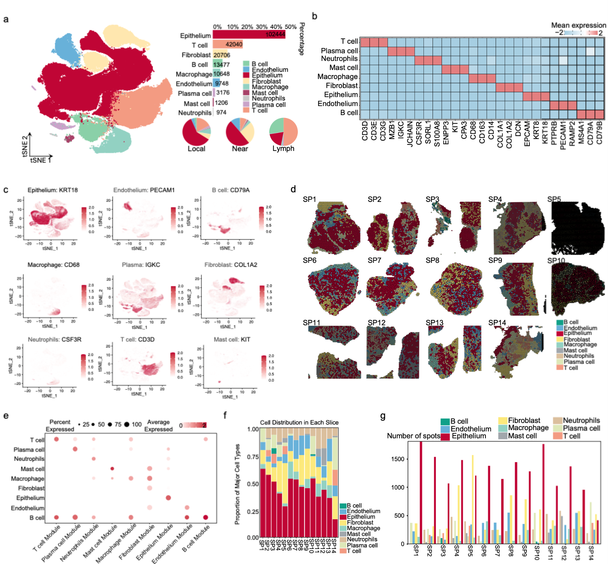

**Single-Cell Spatial Transcriptomic Analysis Reveals Neuron-like Cancer Cells Drive Immunosuppressive Microenvironment Formation in Male Breast Cancer**

Male breast cancer (MBC) is a rare and understudied disease whose cellular and molecular characteristics remain poorly understood. Due to the rarity of MBC samples, our understanding of its tumor biological features has been severely hindered. To deeply investigate the unique cellular states and molecular characteristics in MBC, this study performed integrated single-cell and single-cell spatial sequencing analysis on 25 female breast cancer (FBC) samples and 55 MBC samples. We discovered that malignant tumor cell subpopulations in MBC contain a unique cell subtype that is closely associated with poor prognosis in male breast cancer. This cell subpopulation exhibits distinct neuron-like differentiation features, enriched neuro-meta modules, and enhanced fatty acid metabolism levels. Furthermore, we found that compared to FBC, male patients have lower immune infiltration levels, a phenomenon that may be closely related to the enrichment of neuron-like differentiated tumor cells in MBC. These neuron-like cancer cells may recruit immunosuppressive macrophages (particularly APOE+ macrophages) through cytokines and form highly spatially co-localized relationships with them. In this study, we elucidated the unique tumor microenvironment (TME) characteristics of MBC and explained the possible reasons for immunosuppressive microenvironment formation in MBC, revealing important biological differences between male and female breast cancer. This provides crucial data support for in-depth understanding of MBC molecular characteristics and TME and offers important clinical clues for developing therapeutic strategies to improve MBC patient prognosis.

<b>The single-cell and spatial transcriptome landscape of 27 patients with male breast cancer</b>

## Pre-requisites:

- Linux (Based on Ubuntu 20.04 LTS, Personal Computer) 
- CPU AMD Ryzen threadripper pro 3975wx 32-cores x 64
- NVIDIA GeForce RTX 3090 24GB 384bit 1695MHz 19500MHz 
- Memory 1.024 TiB (128GB * 8) DDR4 2666MHz
